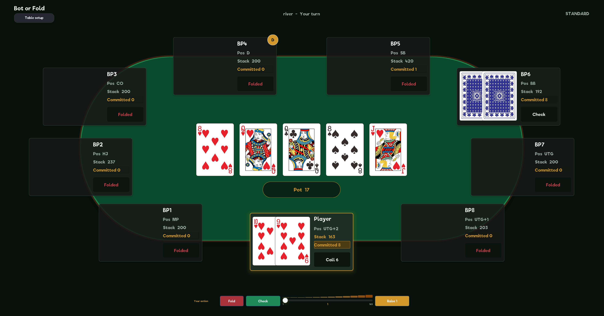

# Bot or Fold

> 在一张完整的德州牌桌上，与真正会计算、会判断局势的 Bot 对手较量。

**Bot or Fold** 是一款使用 C++17 编写的单人德州扑克游戏。它提供现代化的图形界面、完整的多人牌桌规则，以及由蒙特卡洛模拟和底池赔率共同驱动的 BotPlayer 决策系统。

游戏支持标准德州扑克与 Short Deck。你可以选择座位、筹码和对手数量，在 2～9 人桌中经历从 Pre-flop 到 Showdown 的完整牌局。

## 项目亮点



- **现代化 GUI**：清晰的牌桌布局、PNG 扑克牌、状态高亮和流畅的发牌/筹码/摊牌动画。
- **有判断力的 BotPlayer**：Bot 不会简单地按固定牌型下注，而会估算胜率、计算赔率并根据牌局情境选择行动。
- **完整的德州规则**：覆盖盲注、下注轮次、All-in、主池、边池、平分底池和多轮游戏。
- **两种游戏模式**：同时支持 52 张标准牌和 36 张 Short Deck。
- **适合反复对战**：位置、人数、初始筹码和随机性共同带来不同的牌局节奏。

## 图形版

GUI 是当前项目的主要游玩方式。

设置页可以选择玩家名称、标准牌或 Short Deck、牌桌人数、初始筹码和自己的位置。进入牌局后，公共牌和底池位于桌面中央，玩家围绕牌桌分布；每位玩家的筹码、投入、动作和状态都可以直接读取。

游戏提供当前玩家高亮、Bot 思考提示、公共牌发出、筹码进入底池和摊牌翻转等视觉反馈。Raise 使用非线性滑动条：小额区间可以逐筹码微调，大额区间则能快速增长，并支持鼠标滚轮操作。

Round 结束后会自动摊牌并结算，在牌桌上展示各玩家牌型、赢家和获得的筹码，无需切换到额外的结果页面。

图形界面基于优秀的现代 C++ UI 框架 [EUI-NEO](https://github.com/sudoevolve/EUI-NEO) 制作。特别感谢 EUI-NEO 项目：这个框架让本项目得以从最初的 CLI 牌局成长为完整、现代的图形化扑克游戏。

## BotPlayer：会计算赔率的对手

BotPlayer 是本项目的核心特色之一。它采用“**蒙特卡洛胜率模拟 + 底池赔率计算 + 分街决策树**”的组合策略，而不是只查看自己当前组成了什么牌。

### 翻牌前

Bot 会根据起手牌强度、对子/同花/连张特征、所处位置、是否多人底池以及此前的加注次数进行分层判断。面对无人加注、单次加注和 3-bet 等局面时，会进入不同的决策分支。

### 翻牌后

Bot 会从自己的已知信息出发，通过蒙特卡洛模拟补全未知手牌和后续公共牌，估算当前胜率；随后将胜率与跟注成本、底池大小计算出的 pot odds 进行比较。

决策树还会结合：

- 当前处于 Flop、Turn 还是 River；
- 单挑底池或多人底池；
- 当前是否可以免费 Check；
- 手牌优势是否足以价值下注或加注；
- 跟注是否具有合理的赔率；
- 少量混合频率，用于持续下注、半诈唬和纯诈唬。

因此，Bot 的 Fold、Call、Raise 和 All-in 不只是固定阈值的机械反应，而是对牌力、赔率、位置和对手数量的综合判断。同样的两张牌，在不同街道和不同底池环境中可能产生完全不同的行动。

## 游戏模式

| 模式 | 牌组 | 主要区别 |
|---|---:|---|
| Standard | 52 张，2～A | 标准德州扑克规则 |
| Short Deck | 36 张，6～A | 移除 2～5，并采用适配短牌的顺子和牌型规则 |

两种模式都支持完整下注流程、Bot 胜率模拟与牌型评估。

## 快速开始

### 环境要求

- CMake 3.14 或更高版本；
- 支持 C++17 的编译器；
- Git（用于获取 EUI-NEO 子模块）。

项目主要在 Windows + MinGW 环境下开发和验证。基于 [EUI-NEO](https://github.com/sudoevolve/EUI-NEO) 的优秀特性，后续会支持多端版本并发布release。

### 获取源码

```bash
git clone --recurse-submodules https://github.com/Fallflower/Bot_or_Fold.git
cd Bot_or_Fold
```

如果克隆时没有使用 `--recurse-submodules`：

```bash
git submodule update --init --recursive
```

### 构建 GUI

```bash
cmake -S . -B build
cmake --build build --target holdem_gui -j 4
```

Windows 下生成：

```text
build/Bot or Fold.exe
```

可以直接运行该程序，也可以通过 CMake 启动：

```bash
cmake --build build --target run_gui
```

## 多平台发布构建

GitHub Actions 工作流可手动构建四个平台，也会在推送 `v*` tag 时创建
GitHub Release。Release 中每个平台只有一个下载文件：Windows portable ZIP、
Linux x86_64 AppImage、macOS Universal 2 DMG 和 Android arm64-v8a debug APK。

所有平台图标均由 `assets/icon.png` 派生；牌型表继续以
`resources/*.bin` 外部资源文件随各平台包发布。

## 其他构建目标

项目仍保留最初的 CLI 前端，主要用于兼容、调试或纯终端环境。一般游玩建议使用 GUI。

```bash
cmake --build build --target holdem_cli -j 4
```

如果只需要 GUI，可以在配置阶段关闭 CLI：

```bash
cmake -S . -B build -DHOLDEM_BUILD_CLI=OFF
```

## 测试

```bash
cmake --build build -j 4
ctest --test-dir build --output-on-failure
```

测试覆盖游戏快照与结算、控制器状态流，以及标准牌和 Short Deck 的牌型评估。

## 致谢

- [EUI-NEO](https://github.com/sudoevolve/EUI-NEO) — 本项目 GUI 所使用的现代 C++ UI 框架。
- **sudoevolve** — 感谢其开发并开源 EUI-NEO，为 C++ 桌面界面提供了简洁而现代的实现方案。
